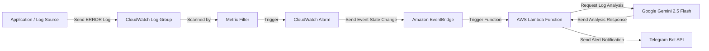

# AIOps Log Analyzer 🚨🧠

An automated Virtual DevOps Assistant to detect application error logs, analyze root causes using AI, and send actionable remediation recommendations directly to Telegram in real-time.

This project is built using a **Serverless** architecture on AWS, automatically deployed using **Terraform (Infrastructure as Code)**, and leverages the **Gemini 2.5 Flash API** as the log analysis engine.

---

## 🏗️ System Architecture

Here is the event-driven workflow of this AIOps system:



---

## ⚡ Key Features
- **Full Automation (IaC)**: The entire AWS infrastructure is defined using Terraform.
- **Serverless & Cost-Effective**: Powered by AWS Lambda, you only pay when error logs are processed (no idle monthly server costs).
- **Security (Least Privilege)**: The Lambda function is deployed with a minimal IAM Role adhering to least-privilege access.
- **Actionable Remediation**: The AI does not just summarize the error; it provides 3 tactical troubleshooting steps for DevOps teams.

---

## 📋 Prerequisites
Before running this project, ensure you have set up the following:
1. **AWS Account & CLI** configured on your local machine (`aws configure`).
2. **Terraform CLI** installed (version `>= 1.0.0`).
3. **Gemini API Key** which can be obtained for free from [Google AI Studio](https://aistudio.google.com/).
4. **Telegram Bot Token**: Obtain this by creating a new bot via `@BotFather` on Telegram.
5. **Telegram Chat ID**: Your personal Telegram Chat ID (can be retrieved by sending `/start` to `@userinfobot` or `@GetIDBot` on Telegram).

---

## 📂 Project Structure
```text
aiops/
├── src/
│   └── lambda_function.py  # AWS Lambda core code (Python)
├── .gitignore              # Ignores sensitive files & cache
├── main.tf                 # AWS resource configuration (Lambda, IAM, CloudWatch, EventBridge)
├── providers.tf            # AWS Provider configuration for Terraform
├── variables.tf            # Input variable declarations
└── terraform.tfvars        # Variable values (API Key, Token, Chat ID - DO NOT COMMIT/UPLOAD!)
```

---

## 🚀 Deployment

### 1. Clone the Repository
```bash
git clone https://github.com/rifaldiusn/aiops-log-analyzer.git
cd aiops-log-analyzer
```

### 2. Configure Environment Variables
Create a file named `terraform.tfvars` in the root directory and populate it with your credentials:

```hcl
aws_region         = "ap-southeast-1" # Your preferred AWS Region (e.g. Singapore)
gemini_api_key     = "YOUR_GEMINI_API_KEY"
telegram_bot_token = "YOUR_TELEGRAM_BOT_TOKEN"
telegram_chat_id   = "YOUR_TELEGRAM_CHAT_ID"
```

### 3. Initialize and Deploy with Terraform
Run the following commands in your terminal:

```bash
# Initialize provider & backend
terraform init

# Plan infrastructure changes
terraform plan

# Deploy to AWS
terraform apply
```
Type `yes` when prompted by Terraform to approve the deployment.

---

## 🧪 Testing

### Quick Test (Direct Invocation)
To verify that AWS Lambda, Gemini, and Telegram are connected correctly, create a `payload.json` file simulating an error:
```json
{"detail": {"message": "ERROR: Database connection pool exhausted."}}
```
Then invoke the Lambda function directly using the AWS CLI:
```bash
aws lambda invoke --function-name "aiops_log_analyzer" --payload file://payload.json --cli-binary-format raw-in-base64-out response.json
```
Check your Telegram app; the bot should immediately send the error analysis.

### Integration Test (End-to-End Log Trigger)
To test the automated detection workflow based on application logs:

1. **Create a new Log Stream in CloudWatch:**
   ```bash
   aws logs create-log-stream --log-group-name "/aws/aiops/simulated_app_logs" --log-stream-name "test-stream"
   ```

2. **Send a new error log:**
   ```powershell
   # On Windows PowerShell:
   $timestamp = [DateTimeOffset]::UtcNow.ToUnixTimeMilliseconds()
   aws logs put-log-events --log-group-name "/aws/aiops/simulated_app_logs" --log-stream-name "test-stream" --log-events timestamp=$timestamp,message="ERROR: Connection timeout on redis cache server."
   ```

3. **Wait 1-2 Minutes**: The CloudWatch Alarm will detect the `"ERROR"` keyword, transition to `ALARM` state, and trigger the automated notification to your Telegram.

---

## 🧹 Clean Up
To avoid unnecessary AWS costs after testing, tear down all created resources using the following command:
```bash
terraform destroy
```
Type `yes` when prompted for confirmation.
